# Linear Regression — Comprehensive Visual Revision Notes

> **Goal:** Understand Linear Regression by **looking first, then reading deeper**.
> **Mental model:**
>
> `DATA → MODEL → PREDICTION → ERROR → LOSS → OPTIMIZATION → VALIDATION → DIAGNOSIS → IMPROVEMENT`

---

# 0. 🧭 Linear Regression — The Whole Picture

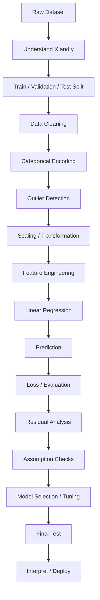

### The central idea

```text
                FEATURES X
                    │
                    ▼
          ┌─────────────────┐
          │ Linear Function │
          │  wᵀx + w₀       │
          └────────┬────────┘
                   │
                   ▼
             Prediction ŷ
                   │
                   ▼
        ┌─────────────────────┐
        │ Compare with true y │
        └──────────┬──────────┘
                   │
                   ▼
             Error / Residual
                   │
                   ▼
                  MSE
                   │
                   ▼
             Optimization
                   │
                   ▼
             Best parameters
```

---

# 1. What Is Linear Regression?

## 1.1 Problem type

| Property             | Linear Regression             |
| -------------------- | ----------------------------- |
| Learning             | **Supervised**                |
| Task                 | **Regression**                |
| Target               | Numerical / continuous        |
| Input                | Numerical after preprocessing |
| Output               | Continuous prediction         |
| Model type           | Parametric                    |
| Default relationship | Linear                        |
| Core loss            | Least Squared Error / MSE     |
| Main parameters      | Weights + intercept           |

The reference defines regression as a supervised task where the target (y) is numerical. For (n) observations and (d) features:

[
X \in \mathbb{R}^{n\times d}
]

[
y \in \mathbb{R}^{n}
]

Each training example is:

[
(X_i,y_i)
]

and the goal is:

[
f:X\rightarrow y
]

such that:

[
f(X_i)\approx y_i
]


---

# 2. Dataset Representation

```text
                 d features
        ┌───────────────────────────┐
Sample 1│ x₁₁  x₁₂  x₁₃ ... x₁d │ → y₁
Sample 2│ x₂₁  x₂₂  x₂₃ ... x₂d │ → y₂
Sample 3│ x₃₁  x₃₂  x₃₃ ... x₃d │ → y₃
  ...   │ ...  ...  ...      ... │
Sample n│ xn₁  xn₂  xn₃ ... xnd │ → yn
        └───────────────────────────┘
                  X                    y
```

### Dimensions

[
X =
\begin{bmatrix}
x_{11}&x_{12}&\cdots&x_{1d}\
x_{21}&x_{22}&\cdots&x_{2d}\
\vdots&\vdots&\ddots&\vdots\
x_{n1}&x_{n2}&\cdots&x_{nd}
\end{bmatrix}
]

[
X\in\mathbb{R}^{n\times d}
]

[
y=
\begin{bmatrix}
y_1\y_2\\vdots\y_n
\end{bmatrix}
\in\mathbb{R}^{n}
]

---

# 3. The Model

## 3.1 Simple Linear Regression

One feature:

[
\boxed{\hat y = wx+w_0}
]

Equivalent to the familiar:

[
y=mx+c
]

```text
ŷ
│                         •
│                    •
│               •
│          •
│     •
│  •
└──────────────────────────── x

        ŷ = wx + w₀
```

---

## 3.2 Multiple Linear Regression

For (d) features:

[
\boxed{
\hat y
======

w_1x_1+w_2x_2+\cdots+w_dx_d+w_0
}
]

Vector form:

[
\boxed{\hat y=w^Tx+w_0}
]

where:

[
w=
[w_1,w_2,\ldots,w_d]^T
]

and

[
x=
[x_1,x_2,\ldots,x_d]^T
]

The supplied notes explicitly connect this to (y=mx+c): with multiple dimensions, the "line" becomes a **hyperplane**. 

---

# 4. 🧮 What Does Each Weight Do?

```text
x₁ ──× w₁ ──┐
             │
x₂ ──× w₂ ──┤
             │
x₃ ──× w₃ ──┼──→ Σ ──→ + w₀ ──→ ŷ
             │
...          │
x_d ─× w_d ──┘
```

### Interpretation

[
\hat y=w_1x_1+w_2x_2+\cdots+w_dx_d+w_0
]

| Parameter | Meaning                      |
| --------- | ---------------------------- |
| (x_j)     | Feature                      |
| (w_j)     | Feature coefficient / weight |
| (w_0)     | Bias / intercept             |
| (\hat y)  | Prediction                   |

### Sign

```text
w > 0
x ↑
 ↓
ŷ ↑

w < 0
x ↑
 ↓
ŷ ↓
```

The PDF specifically states that a negative weight means increasing that feature decreases the prediction. 

---

# 5. Geometry — Line → Hyperplane

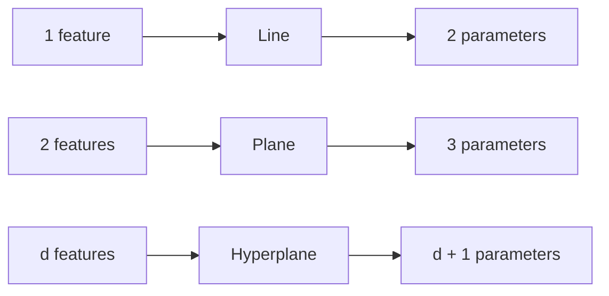

| Number of features | Geometric model            |
| -----------------: | -------------------------- |
|                  1 | Line                       |
|                  2 | Plane                      |
|                (d) | (d)-dimensional hyperplane |

---

# 6. 🎯 What Is the "Best" Line?

Many possible lines can pass through approximately the same data.

```text
ŷ
│       •
│     •   •
│   •  /───── Model A
│ •   /
│   /─────── Model B
│ /
└────────────────── x
```

We need a mathematical definition of **best**.

### Training objective

```text
DATA
 ↓
MODEL
 ↓
ŷ
 ↓
ERROR = y − ŷ
 ↓
SQUARED ERROR
 ↓
AVERAGE
 ↓
MSE
 ↓
MINIMIZE
 ↓
BEST w, w₀
```

---

# 7. Residual / Error

For observation (i):

[
\boxed{e_i=y_i-\hat y_i}
]

```text
Actual y
   •
   │
   │ eᵢ
   │
   •
Predicted ŷ
```

* (e_i>0) → model **underpredicted**
* (e_i<0) → model **overpredicted**
* (e_i=0) → exact prediction

---

# 8. MSE — Mean Squared Error

The core loss in the supplied Linear Regression material is Mean Squared Error:

[
\boxed{
MSE=
\frac1n
\sum_{i=1}^{n}
(y_i-\hat y_i)^2
}
]

Substitute the model:

[
\boxed{
L(w,w_0)
========

\frac1n
\sum_{i=1}^{n}
\left[
y_i-(w^Tx_i+w_0)
\right]^2
}
]


---

## Why square the error?

```text
Error
  │
  ├── positive ──┐
  │              │
  └── negative ──┤
                 ▼
              square
                 │
                 ▼
          both become positive
```

### Squaring also emphasizes large errors

[
1^2=1
]

but

[
10^2=100
]

Therefore:

> **MSE is strongly influenced by large errors/outliers.**

This is one reason Linear Regression is sensitive to outliers.

---

# 9. MSE Optimization

The optimization problem:

[
\boxed{
\min_{w,w_0}
\frac1n
\sum_{i=1}^{n}
(y_i-\hat y_i)^2
}
]

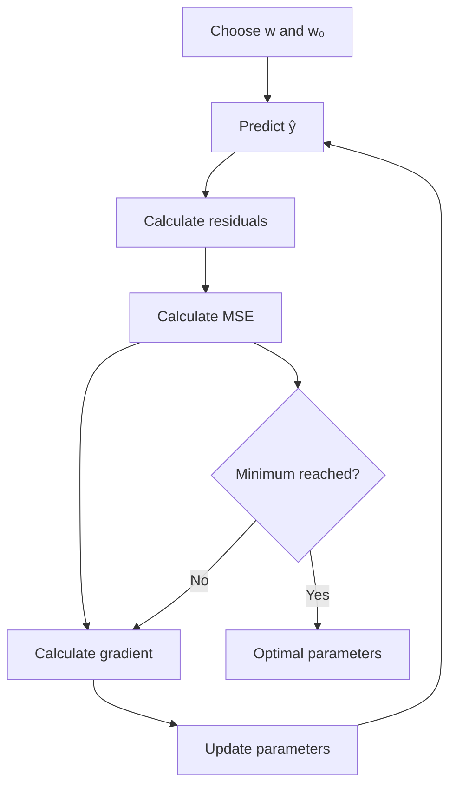

---

# 10. Why Gradient Descent?

The loss surface for Linear Regression with MSE is convex.

```text
Loss
 ▲
 │                 •
 │              •     •
 │            •         •
 │          •             •
 │       •       ↓          •
 │     •        MIN         •
 │____•_______________________•___→ weights
```

There is a global minimum.

So:

```text
MSE
 ↓
Convex loss surface
 ↓
Gradient points uphill
 ↓
Move opposite gradient
 ↓
Reach minimum
```

---

# 11. Gradient Descent — Intuition

Imagine standing on a hill.

```text
          Current position
                 ●
                /
               /
      ________/ 
     /          \
____/____________\____
                 ↓
            steepest descent
```

The gradient tells you:

> **Which direction increases loss most rapidly.**

Therefore:

[
\boxed{
\text{Move in }-\nabla L
}
]

---

# 12. Gradient Derivation

Start with:

[
L(w,w_0)
========

\frac1n
\sum_{i=1}^{n}
\left[
y_i-(w^Tx_i+w_0)
\right]^2
]

For (w):

[
\frac{\partial L}{\partial w}
=============================

\frac{2}{n}
\sum_{i=1}^{n}
\left[
y_i-(w^Tx_i+w_0)
\right](-x_i)
]

Equivalent form:

[
\boxed{
\frac{\partial L}{\partial w}
=============================

\frac{2}{n}
\sum_{i=1}^{n}
(\hat y_i-y_i)x_i
}
]

The supplied PDF derives the gradient through the chain rule and reaches the same structure. 

---

## Bias gradient

Because:

[
\hat y_i=w^Tx_i+w_0
]

and:

[
\frac{\partial \hat y_i}{\partial w_0}=1
]

we obtain:

[
\boxed{
\frac{\partial L}{\partial w_0}
===============================

\frac{2}{n}
\sum_{i=1}^{n}
(\hat y_i-y_i)
}
]

---

# 13. Gradient Descent Update

[
\boxed{
w\leftarrow w-\eta\frac{\partial L}{\partial w}
}
]

[
\boxed{
w_0\leftarrow
w_0-\eta\frac{\partial L}{\partial w_0}
}
]

where (\eta) is the **learning rate**.

---

# 14. Learning Rate

```text
η too small
   ↓
tiny steps
   ↓
very slow convergence


η appropriate
   ↓
efficient descent
   ↓
convergence


η too large
   ↓
huge steps
   ↓
overshooting
   ↓
oscillation / divergence
```

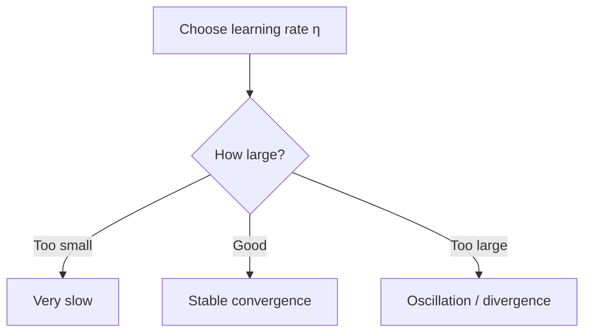

---

# 15. Batch vs Iterative Optimization

The conceptual loop is:

```text
Initialize w, w₀
      ↓
Predict
      ↓
Calculate loss
      ↓
Calculate gradients
      ↓
Update
      ↓
Repeat
```

For large datasets, iterative optimization can be preferable to explicitly solving a matrix inverse.

---

# 16. Normal Equation — Closed-Form Solution

Instead of repeatedly updating weights:

[
\boxed{
W=(X^TX)^{-1}X^TY
}
]

This is the closed-form / Normal Equation presented in the PDF. 

### Conceptual difference

```text
              FIND OPTIMAL W
                    │
          ┌─────────┴──────────┐
          ↓                    ↓
   Gradient Descent       Normal Equation
          │                    │
      Iterative             Closed form
          │                    │
   learning rate needed     No GD iterations
          │                    │
      many updates          Matrix operations
          │                    │
   good for many features   costly as d grows
```

---

# 17. Normal Equation — Dimensions

Given:

[
X\in\mathbb{R}^{n\times d}
]

[
Y\in\mathbb{R}^{n\times1}
]

then:

[
X^TX\in\mathbb{R}^{d\times d}
]

and:

[
(X^TX)^{-1}X^TY
]

produces the weight vector.

The supplied notes explicitly identify (X) as (n\times d) and (Y) as (n\times1). 

---

# 18. Gradient Descent vs Normal Equation

| Property       | Gradient Descent                | Normal Equation           |
| -------------- | ------------------------------- | ------------------------- |
| Approach       | Iterative                       | Closed-form               |
| Learning rate  | Required                        | Not required              |
| Iterations     | Yes                             | No                        |
| Matrix inverse | No                              | Yes                       |
| Very high (d)  | Often preferable                | Can become expensive      |
| Convex MSE     | Converges toward global minimum | Direct optimum            |
| Main tuning    | Learning rate / iterations      | Solver / numerical method |

> ⚠️ **Source note:** The reference describes explicitly forming ((X^TX)^{-1}). In practical numerical linear algebra, solving the system using stable factorizations such as QR/SVD is generally preferable to explicitly computing an inverse.

---

# 19. Simple vs Multiple Linear Regression

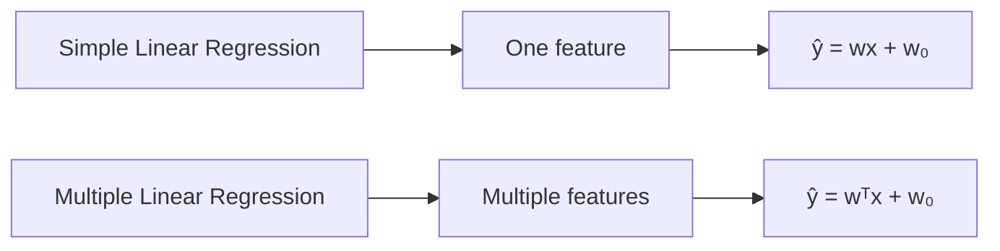

---

# 20. Model Complexity

```text
Few features / low degree
          ↓
       simple model
          ↓
       high bias
          ↓
       underfitting

More features / higher degree
          ↓
      complex model
          ↓
       low bias
          ↓
    possible overfitting
```

---

# 21. Polynomial Regression

Ordinary Linear Regression:

[
\hat y=w_1x+w_0
]

Polynomial feature expansion:

[
\boxed{
\hat y
======

w_0+w_1x+w_2x^2+w_3x^3+\cdots
}
]

The supplied PDF explicitly introduces polynomial features as a way of making Linear Regression capable of modelling nonlinear relationships. 

---

## Why is it still "Linear" Regression?

The model is nonlinear in **(x)**:

[
x,\ x^2,\ x^3
]

but linear in its **parameters**:

[
w_0,w_1,w_2,w_3
]

```text
Original x
   │
   ├── x
   ├── x²
   ├── x³
   └── ...
        ↓
Feature matrix
        ↓
Linear Regression
        ↓
Curved prediction in original x-space
```

### Important distinction

[
\boxed{
\text{Linear in parameters} \neq \text{necessarily linear in raw features}
}
]

---

# 22. Polynomial Regression — Risk

```text
Degree 1
────────────
Simple line


Degree 2–3
────────────
Flexible curve


Very high degree
╱╲╱╲╱╲╱╲
Fits noise
```

Higher degree:

[
\Rightarrow \text{higher complexity}
\Rightarrow \text{higher variance}
\Rightarrow \text{greater overfitting risk}
]

---

# 23. Bias–Variance Tradeoff

The PDF uses the intuition of target shooting:

```text
HIGH BIAS
→ consistently wrong
→ wrong aim


HIGH VARIANCE
→ predictions change substantially
→ unstable aim
```


### Visual

```text
                    MODEL COMPLEXITY
          Low ───────────────────────── High

Bias       HIGH ───────────→──────────── LOW

Variance    LOW ────────────→──────────── HIGH

Training
error       HIGH ───────────→──────────── VERY LOW

Test
error       HIGH ───── LOW ───────────── HIGH
                    ▲
                    │
              sweet spot
```

---

# 24. Underfitting vs Good Fit vs Overfitting

| Property       | Underfit | Good Fit    | Overfit  |
| -------------- | -------- | ----------- | -------- |
| Complexity     | Low      | Appropriate | High     |
| Bias           | High     | Balanced    | Low      |
| Variance       | Low      | Balanced    | High     |
| Train error    | High     | Low         | Very low |
| Test error     | High     | Low         | High     |
| Learns noise?  | No       | No          | Yes      |
| Generalization | Poor     | Good        | Poor     |

The supplied PDF states that an underfit model has high training and testing loss, while an overfit model has very low training loss but high testing loss. 

---

# 25. Occam's Razor

```text
Model A
████████████████
very complex
fits every point
including noise

Model B
████████
simpler
captures dominant pattern

Prefer B when predictive performance is comparable.
```

> **Simpler model + similar predictive performance → usually preferable.**

The PDF explicitly connects the simpler model idea with **Occam's Razor**. 

---

# 26. Regularization

Regularization adds a penalty to the objective.

```text
Original objective
       +
Complexity penalty
       ↓
Total objective
       ↓
Optimization
       ↓
Smaller / simpler weights
```

General form:

[
\boxed{
L_{\text{total}}
================

L_{\text{data}}
+
\lambda\cdot\text{complexity penalty}
}
]

---

# 27. Effect of (\lambda)

```text
λ = 0
 ↓
No regularization
 ↓
Potential overfitting


λ optimal
 ↓
Balanced complexity
 ↓
Good generalization


λ very large
 ↓
Weights heavily penalized
 ↓
Underfitting
```

The reference explicitly describes too little regularization as overfitting and too much as underfitting. 

---

# 28. L2 / Ridge

Penalty:

[
\boxed{
\lambda\sum_{j=1}^{d}w_j^2
}
]

Objective:

[
\boxed{
L_{\text{Ridge}}
================

MSE+
\lambda\sum_{j=1}^{d}w_j^2
}
]

### Effect

```text
Large weights
     ↓
Strong penalty
     ↓
Weights shrink
     ↓
Less extreme model
     ↓
Lower variance
```

Ridge usually makes coefficients **small**, but does not generally force them exactly to zero.

---

# 29. L1 / Lasso

Penalty:

[
\boxed{
\lambda\sum_{j=1}^{d}|w_j|
}
]

Objective:

[
\boxed{
L_{\text{Lasso}}
================

MSE+
\lambda\sum_{j=1}^{d}|w_j|
}
]

### Key effect

```text
Many coefficients
       ↓
L1 penalty
       ↓
Some coefficients → 0
       ↓
Sparse model
       ↓
Implicit feature selection
```

The supplied PDF explicitly describes L1/Lasso as producing a sparse weight vector. 

---

# 30. ElasticNet

Combines L1 + L2:

[
\boxed{
L=
MSE+
\lambda_1\sum_jw_j^2+
\lambda_2\sum_j|w_j|
}
]

```text
ElasticNet
     │
     ├── L1 → sparsity / selection
     │
     └── L2 → shrinkage / stability
```

> ⚠️ **Source notation note:** The PDF associates (\lambda_1) with the squared term and (\lambda_2) with the absolute-value term. Naming conventions vary; the important concept is the **combination of L1 and L2 penalties**. 

---

# 31. Regularization Comparison

| Property                    | No Regularization | Ridge     | Lasso                  | ElasticNet      |
| --------------------------- | ----------------- | --------- | ---------------------- | --------------- |
| Penalty                     | None              | (L2)      | (L1)                   | (L1+L2)         |
| Shrinks weights             | ❌                 | ✅         | ✅                      | ✅               |
| Exact zeros                 | ❌                 | Usually ❌ | ✅                      | ✅ possible      |
| Feature selection           | ❌                 | ❌         | ✅                      | ✅               |
| Handles correlated features | Weak              | Good      | Can select arbitrarily | Often useful    |
| Main effect                 | Fit data          | Stabilize | Sparse model           | Sparse + stable |

---

# 32. Feature Scaling

Suppose:

```text
Age       → 20–60
Income    → 20,000–2,000,000
```

Without scaling:

```text
Different feature magnitudes
          ↓
Different coefficient magnitudes
          ↓
Harder coefficient comparison
          +
Gradient descent can have poor conditioning
```

The supplied scaling reference emphasizes common scaling methods and improved convergence for algorithms affected by feature scale. 

---

# 33. Standardization

[
\boxed{
x'=\frac{x-\mu}{\sigma}
}
]

Result:

[
\mu_{x'}\approx0
]

[
\sigma_{x'}\approx1
]

```text
Raw feature
     ↓
subtract mean
     ↓
divide by std
     ↓
mean ≈ 0
std ≈ 1
```

---

# 34. Min-Max Scaling

[
\boxed{
x'=
\frac{x-x_{\min}}
{x_{\max}-x_{\min}}
}
]

Usually:

[
x'\in[0,1]
]

Example:

```text
10 → 0.00
20 → 0.25
30 → 0.50
40 → 0.75
50 → 1.00
```


---

# 35. Robust Scaling

[
\boxed{
x'=
\frac{x-\operatorname{median}(x)}
{IQR(x)}
}
]

```text
Mean/std
   ↓
sensitive to outliers

Median/IQR
   ↓
more robust
```

The source specifically presents Robust Scaling as less sensitive to outliers. 

---

# 36. Max-Abs Scaling

[
\boxed{
x'=\frac{x}{\max(|x|)}
}
]

Typical range:

[
[-1,1]
]

Useful when preserving sparsity/sign structure matters.


---

# 37. Unit Vector Scaling

[
\boxed{
x'=\frac{x}{|x|}
}
]

Example:

[
[3,4]
\rightarrow
[0.6,0.8]
]

because:

[
\sqrt{3^2+4^2}=5
]


> **Source note:** The supplied reference highlights unit-vector normalization mainly for clustering/distance-based methods; it is generally not the default scaling choice for ordinary Linear Regression.

---

# 38. Which Scaling Should I Use?

```text
Need general-purpose scaling?
        ↓
Standardization

Need [0,1] range?
        ↓
Min-Max

Strong outliers?
        ↓
Robust Scaling

Sparse data / preserve zeros?
        ↓
Max-Abs

Distance / vector direction?
        ↓
Unit Vector
```

---

# 39. Is Scaling Required for Linear Regression?

| Situation                         | Scaling                      |
| --------------------------------- | ---------------------------- |
| Ordinary least squares prediction | Not mathematically mandatory |
| Gradient descent                  | **Strongly recommended**     |
| Ridge/Lasso/ElasticNet            | **Important**                |
| Comparing coefficient magnitudes  | **Important**                |
| Polynomial features               | Often important              |
| Normal Equation                   | Not mathematically required  |
| Mixed feature magnitudes          | Recommended                  |

### Why regularization especially cares

Suppose:

[
x_1\in[0,1]
]

and

[
x_2\in[0,1,000,000]
]

The regularization penalty acts directly on coefficients, so scale affects how much a feature's coefficient must shrink.

---

# 40. ⚠️ Scaling Must Avoid Data Leakage

Wrong:

```text
Entire dataset
     ↓
Fit scaler
     ↓
Train/Test split
```

Correct:

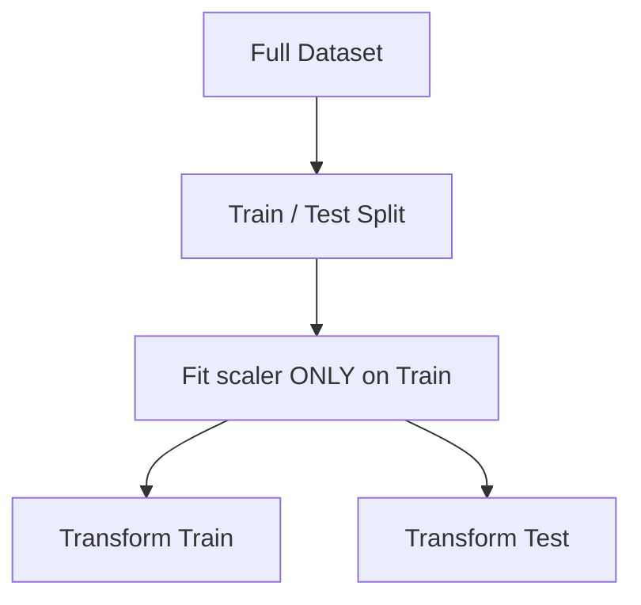

Never allow information from the test set to influence preprocessing parameters.

---

# 41. Feature Interpretation

For:

[
\hat y=w_1x_1+w_2x_2+w_0
]

If:

[
w_1=5
]

then, holding other features constant:

```text
x₁ ↑ by 1 unit
       ↓
ŷ ↑ by 5 units
```

If:

[
w_2=-3
]

then:

```text
x₂ ↑ by 1 unit
       ↓
ŷ ↓ by 3 units
```

---

# 42. Why Raw Coefficient Magnitude Can Mislead

Suppose:

```text
Feature A:
range = 0–10

Feature B:
range = 0–1,000,000
```

A large numerical coefficient does **not automatically mean greater importance**.

```text
Feature scale
     ↓
coefficient magnitude
     ↓
raw comparison becomes misleading
```

The PDF explicitly uses column standardization to make coefficient comparison less ambiguous. 

> **Additional context:** Standardized coefficients can make relative effect-size comparison more meaningful, but coefficient magnitude still isn't a universal measure of causal importance or predictive importance.

---

# 43. Categorical Variables

Linear Regression operates numerically.

```text
City
 ├── Bangalore
 ├── Mumbai
 └── Delhi
        ↓
   Encode numerically
        ↓
Linear Regression
```

The supplied categorical encoding reference contains five techniques. 

---

# 44. One-Hot Encoding

```text
City

Bangalore → [1,0,0]
Mumbai    → [0,1,0]
Delhi     → [0,0,1]
```

For nominal categories:

[
\boxed{\text{One category} \rightarrow \text{one binary feature}}
]

### Best when

* categories have no natural ordering
* number of categories is manageable

### Risk

```text
High cardinality
      ↓
Many columns
      ↓
High dimensionality
      ↓
Potential multicollinearity / complexity
```

For an intercept-containing model, one category is commonly dropped to avoid the dummy-variable trap:

[
k\text{ categories}
\rightarrow
k-1\text{ dummy variables}
]

---

# 45. Label Encoding

```text
A → 0
B → 1
C → 2
```

### Problem for Linear Regression

The model may interpret:

[
C>B>A
]

and treat the differences as meaningful.

The source itself warns that label encoding can introduce an artificial ordering for Linear Regression. 

> ⚠️ **Source inconsistency:** The source says Label Encoding "works well when there is no ordinal relationship" but immediately warns that it can confuse Linear Regression. For Linear Regression, the warning is the important practical point: **do not use arbitrary integer codes for nominal categories.**

---

# 46. Ordinal Encoding

Use when order is real:

```text
Low    → 0
Medium → 1
High   → 2
```

```text
Low < Medium < High
       ↑
real semantic ordering
```

Appropriate when the category itself has meaningful rank.


---

# 47. Frequency Encoding

Encode using category frequency:

```text
A occurs 2 times → 2
B occurs 2 times → 2
C occurs 1 time  → 1
```

[
\boxed{
\text{encoding(category)}
=========================

\text{frequency(category)}
}
]

### Advantage

```text
High cardinality
     ↓
Single numeric column
     ↓
Lower dimensionality
```

### Caveat

Frequency may have no meaningful relationship with the target.


---

# 48. Target Encoding

For regression:

[
\boxed{
Encoding(c)
===========

\operatorname{mean}(y\mid category=c)
}
]

Example:

```text
Category A → average target = 150
Category B → average target = 80
Category C → average target = 220
```

### Powerful but dangerous

```text
Target
   ↓
Encoding
   ↓
Model sees target-derived feature
   ↓
Potential leakage
   ↓
Overoptimistic validation
```

Target encoding must be fitted using training data / out-of-fold procedures.

The source explicitly warns about validation and leakage. 

---

# 49. Encoding Cheat Sheet

| Method    | Nominal? |          Ordinal? | High Cardinality? | Main Risk                        |
| --------- | -------: | ----------------: | ----------------: | -------------------------------- |
| One-Hot   |        ✅ | ✅ but unnecessary |                 ❌ | Many columns                     |
| Label     |       ⚠️ |                 ✅ |                 ✅ | Artificial order                 |
| Ordinal   |        ❌ |                 ✅ |                 ✅ | Incorrect order if badly defined |
| Frequency |        ✅ |                 ✅ |                 ✅ | Frequency ≠ target effect        |
| Target    |        ✅ |                 ✅ |                 ✅ | Leakage / overfitting            |

---

# 50. Outliers — Why Linear Regression Cares

Remember:

[
MSE=\frac1n\sum e_i^2
]

An extreme residual gets squared.

```text
Normal error
     │
     ▼
small contribution


Huge error
     │
     ▼
squared
     │
     ▼
VERY large contribution
     │
     ▼
regression line gets pulled
```

---

# 51. Outlier ≠ Automatically Bad Data

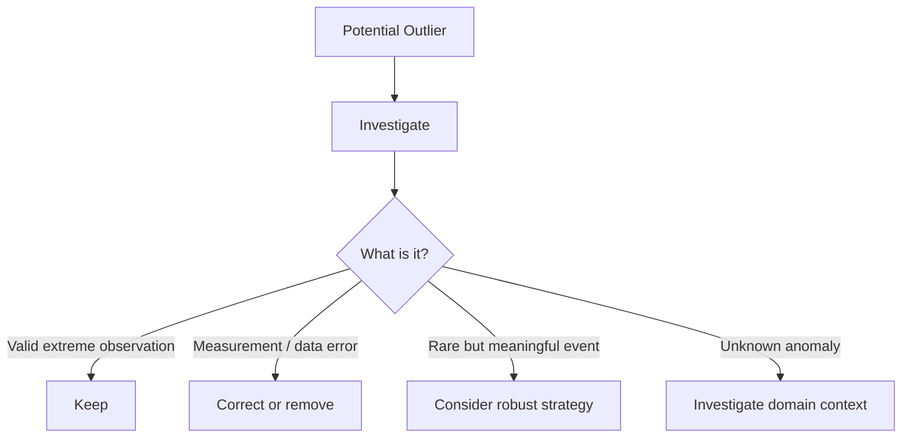

Never blindly delete all outliers.

---

# 52. Outlier Detection — Statistical Methods

## Z-Score

[
\boxed{
Z=\frac{x-\mu}{\sigma}
}
]

Common rule:

[
|Z|>3
]

→ potential outlier.


```text
          mean
-----------|-----------
      -3σ  |  +3σ
        ←── normal ──→
```

### Weakness

Mean and standard deviation themselves can be distorted by outliers.

Source notes that Z-score works well for approximately normal data and may fail for skewed distributions. 

---

# 53. IQR Method

[
IQR=Q_3-Q_1
]

Lower bound:

[
\boxed{
Q_1-1.5(IQR)
}
]

Upper bound:

[
\boxed{
Q_3+1.5(IQR)
}
]

```text
     outlier                outlier
        ●                      ●
────────┼───────[ BOX ]────────┼──────
       Q1                     Q3
```

More robust than mean/std-based detection.


---

# 54. Modified Z-Score

Uses median + MAD:

[
\boxed{
MZ=
\frac{0.6745(x-\operatorname{median})}{MAD}
}
]

where:

[
MAD=\operatorname{median}
\left(
|x-\operatorname{median}(x)|
\right)
]

The source gives this formula explicitly. 

### Why useful?

```text
Mean / Std
   ↓
easily influenced by extremes

Median / MAD
   ↓
more robust
```

---

# 55. Isolation Forest

Core intuition:

```text
Normal points
██████████████████
harder to isolate


Outlier
      ●
      ↓
few random splits
      ↓
short path
      ↓
anomaly
```

The source describes shorter average path lengths as indicative of outliers. 

---

# 56. DBSCAN Outlier Detection

DBSCAN is density-based.

```text
██████████
██████████     ●
██████████
             ↑
       low-density point
       → noise / outlier
```

A point labeled `-1` is treated as noise by DBSCAN.


### Useful when

* data has spatial structure
* dense clusters exist
* isolated points should be detected

---

# 57. Local Outlier Factor — LOF

LOF asks:

> **Is this point much less dense than its neighbors?**

```text
Dense neighborhood

● ● ●
 ● ●
● ● ●


Outlier

● ● ●
 ● ●
             X
```

The source describes LOF as comparing local density against neighboring density. 

---

# 58. Outlier Detection Comparison

| Method           | Main idea           | Strength        | Weakness                            |
| ---------------- | ------------------- | --------------- | ----------------------------------- |
| Z-score          | Distance from mean  | Simple          | Sensitive to skew/outliers          |
| IQR              | Quartile boundaries | Robust          | Distribution/sample limitations     |
| Modified Z       | Median + MAD        | Robust          | Less familiar                       |
| Isolation Forest | Isolation path      | Multivariate    | Parameter/data dependent            |
| DBSCAN           | Density             | Cluster-aware   | `eps`, `min_samples` sensitive      |
| LOF              | Local density       | Local anomalies | Can be sensitive in high dimensions |

Source caveats are summarized in the supplied outlier reference. 

---

# 59. Outlier Treatment

The supplied handling reference gives:

```text
Detect
  ↓
Investigate
  ↓
Choose treatment
```

Possible treatments:

1. Remove
2. Transform
3. Winsorize
4. Impute
5. Bin
6. Robust regression
7. Clustering-based identification


---

# 60. Remove Outliers

```text
Data
 ↓
Detect extreme observation
 ↓
Verify it is erroneous / inappropriate
 ↓
Remove
```

### Advantage

Simple.

### Risk

```text
Remove
  ↓
Information loss
```

The source explicitly warns about data loss. 

---

# 61. Transformations

For positive skewed values:

[
x'=\log(x)
]

or potentially:

[
x'=\sqrt{x}
]

```text
Right-skewed
      ↓
log transform
      ↓
less skewed
      ↓
less influence from extreme values
```

The supplied handling reference specifically gives log transformation. 

⚠️ Log transformation requires care with zero/negative values. 

---

# 62. Winsorization

Instead of deleting:

```text
1000
 ↓
cap at upper percentile
 ↓
95th-percentile value
```

```text
Original:
● ● ● ● ● ● ●                ●

Winsorized:
● ● ● ● ● ● ●              ●●
```

Useful when the extreme observation is meaningful but excessively influential.


---

# 63. Outlier Imputation

Replace extreme values with:

* mean
* median
* mode

The supplied source specifically demonstrates median replacement. 

### Caveat

```text
Outlier
 ↓
replace
 ↓
distribution altered
 ↓
possible bias
```

---

# 64. Binning

Convert continuous values into ranges:

```text
0–25
25–50
50–75
75+
```

Useful when exact extreme values are less important than ranges.


---

# 65. Robust Regression — RANSAC

Instead of forcing every point to influence the line equally:

```text
Main population
● ● ● ● ● ● ●
 ● ● ● ● ●

Outliers
                    X
                       X

RANSAC
 ↓
fit dominant pattern
 ↓
reduce outlier influence
```

The source presents `RANSACRegressor` as a model-based outlier-handling approach. 

---

# 66. Multicollinearity

## Collinearity

Two features are strongly linearly related:

[
x_1\approx\alpha x_2
]

## Multicollinearity

A feature can be explained using several other features:

[
x_1
\approx
\alpha_1x_2+\alpha_2x_3+\alpha_3x_4
]

The supplied PDF makes this distinction explicitly.

---

# 67. Why Multicollinearity Is a Problem

```text
X₁ ───────────────┐
                  │
                  ├── strongly related
                  │
X₂ ───────────────┘
          ↓
They contain overlapping information
          ↓
Hard to separate individual effects
          ↓
Unstable coefficients
          ↓
Unreliable interpretation
```

The PDF emphasizes unreliable feature importance / interpretability. 

---

# 68. Multicollinearity Detection — VIF

For feature (X_j), regress it against all the other predictors and calculate:

[
R_j^2
]

Then:

[
\boxed{
VIF_j=
\frac{1}{1-R_j^2}
}
]

Interpretation:

```text
VIF ≈ 1
↓
little collinearity

VIF ↑
↓
increasing multicollinearity
```

The supplied Linear Regression reference gives a practical rule that VIF above roughly **5–10** suggests high multicollinearity. 

---

# 69. VIF Workflow

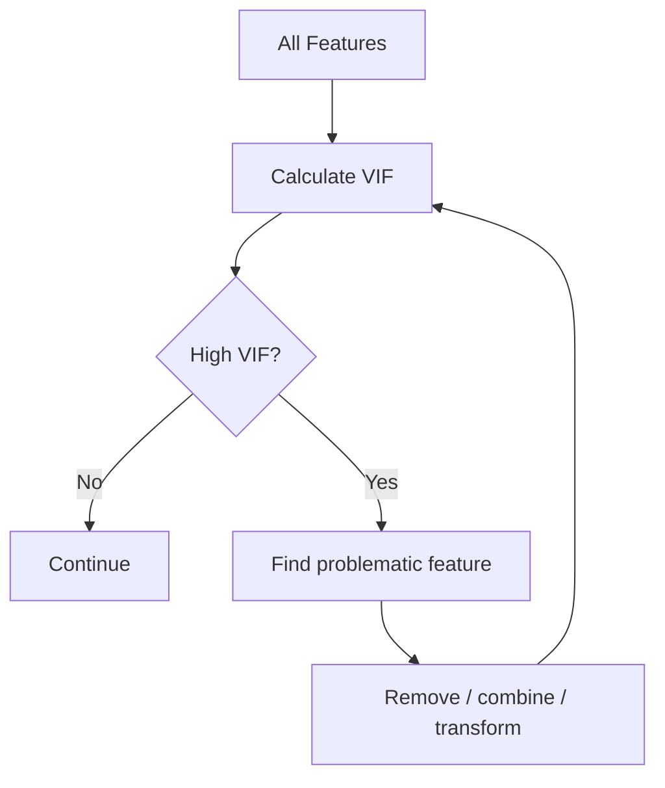

Possible solutions:

```text
High VIF
  ↓
├── Remove redundant feature
├── Combine features
├── Feature selection
├── PCA
└── Ridge / regularization
```

The GitHub Linear Regression reference specifically suggests Ridge/Lasso, PCA, and removing/combining correlated features. 

---

# 70. Perfect Multicollinearity

If:

[
x_3=x_1+x_2
]

exactly, then one feature is perfectly determined by the others.

```text
Perfect relationship
       ↓
Singular XᵀX
       ↓
Unique coefficients cannot be estimated
```

The supplied reference identifies perfect collinearity as a condition that can make the matrix singular and prevent fitting. 

---

# 71. Heteroskedasticity

### Homoscedasticity

Residual variance stays approximately constant.

```text
Residual
   ↑
 + |  • • • •
   | • • • • •
 0 |• • • • • •
   | • • • •
 - |  • • • •
   └────────────→ ŷ
```

### Heteroskedasticity

Residual spread changes.

```text
Residual
   ↑
 + |             •
   |         • • •
 0 |    • • • • • •
   | • •
 - | •
   └────────────────→ ŷ
```

The supplied source identifies heteroskedasticity as non-constant error variance. 

---

# 72. How to Detect Heteroskedasticity

Primary visual:

[
\boxed{
\text{Residuals }e_i
\quad\text{vs}\quad
\hat y_i
}
]

Look for:

```text
Random cloud → good

Funnel / cone → heteroskedasticity
Curve         → non-linearity
Isolated point → possible outlier
```

The PDF specifically recommends a residual plot of errors versus predictions. 

---

# 73. Remedies for Heteroskedasticity

From the supplied Linear Regression reference:

```text
Heteroskedasticity
       ↓
├── Transform target
│   ├── log
│   └── square root
│
├── Weighted Least Squares
│
└── Robust standard errors
```


> ⚠️ **Important distinction:** heteroskedasticity does not automatically make ordinary least-squares predictions unusable. It particularly affects the usual variance estimates and statistical inference.

---

# 74. Normality of Errors

Assumption:

[
e_i\sim N(0,\sigma^2)
]

Conceptually:

```text
Residuals

       •
     • • •
   • • • • •
 • • • • • • •
───────────────
        0
```

### Why?

Normal residuals are especially important for classical:

* confidence intervals
* hypothesis tests
* p-values
* small-sample inference

The supplied Linear Regression reference explicitly connects normal residuals to inference. 

---

# 75. How to Check Normality

```text
Residuals
   ↓
Q-Q plot
   ↓
Do points approximately follow diagonal?
```

Possible checks:

* Q-Q plot
* Shapiro-Wilk
* Kolmogorov-Smirnov

The supplied source lists these methods. 

> **Important:** Normality of errors is not required for the least-squares coefficient estimates themselves to exist, and it is less critical for pure prediction than for classical inference.

---

# 76. Autocorrelation

Especially important for time series.

```text
e₁ → e₂ → e₃ → e₄ → e₅
     ↑     ↑
    related errors
```

Autocorrelation means residuals are correlated across observations, often across time.

The PDF describes it as dependence on previous observations and identifies it as violating the independence assumption. 

---

# 77. Why Autocorrelation Matters

```text
Time
 ↓

Residual₁ ──→ Residual₂ ──→ Residual₃
                  │
                  ↓
             not independent
                  ↓
       standard error estimates
             can be wrong
```

### Detection

* residuals over time
* autocorrelation plots
* Durbin-Watson test

The GitHub reference specifically mentions residual-over-time plots and Durbin-Watson. 

---

# 78. Autocorrelation Remedies

```text
Autocorrelation
      ↓
├── Add lag features
├── Model temporal structure
└── Use time-series models
       └── e.g. ARIMA
```

The supplied Linear Regression source gives ARIMA and lag features as possible remedies. 

---

# 79. Exogeneity / No Endogeneity

A deeper regression assumption:

[
\boxed{
Cov(X,\epsilon)=0
}
]

Intuition:

```text
X
 │
 ├────→ Y
 │
 └──X──→ error
        ↑
       BAD
```

If (X) correlates with the error term:

```text
X ↔ ε
 ↓
biased / inconsistent coefficient estimates
```

The supplied Linear Regression reference identifies exogeneity and mentions instrumental variables as a possible remedy. 

---

# 80. Linear Regression Assumption Checklist

```text
┌─────────────────────────────────────────────┐
│        LINEAR REGRESSION CHECKLIST          │
├─────────────────────────────────────────────┤
│ □ Linearity                                 │
│ □ Independent errors                        │
│ □ Constant residual variance                │
│ □ No problematic multicollinearity          │
│ □ No perfect collinearity                   │
│ □ Residual normality for classical inference│
│ □ Exogeneity                                │
│ □ Appropriate data / measurement quality    │
└─────────────────────────────────────────────┘
```

---

# 81. Residual Analysis

Residual:

[
\boxed{
e_i=y_i-\hat y_i
}
]

Residual analysis is essentially:

```text
Residuals
   ↓
Look for patterns
   ↓
Patterns = clues
   ↓
Diagnose assumption / data problem
   ↓
Fix
```

---

# 82. Residual Pattern → Diagnosis

| Residual pattern     | Likely issue           |
| -------------------- | ---------------------- |
| Random cloud         | Good                   |
| Curve                | Non-linearity          |
| Funnel               | Heteroskedasticity     |
| Large isolated point | Outlier                |
| Runs over time       | Autocorrelation        |
| Clusters             | Missing structure      |
| Increasing spread    | Heteroskedasticity     |
| Systematic trend     | Model misspecification |

---

# 83. Residual Diagnostic Map

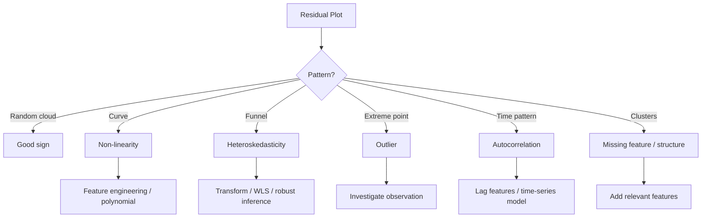

---

# 84. R² — Coefficient of Determination

Baseline idea:

```text
How good is our model
compared with
always predicting the mean?
```

Define:

[
SSE=\sum_i(y_i-\hat y_i)^2
]

[
SST=\sum_i(y_i-\bar y)^2
]

Then:

[
\boxed{
R^2=
1-\frac{SSE}{SST}
}
]

---

# 85. Interpretation of R²

Approximately:

```text
R² = 0
 ↓
no improvement over mean baseline

R² = 1
 ↓
perfect fit

R² < 0
 ↓
can be worse than mean baseline
```

> ⚠️ (R^2) is **not** simply "percentage accuracy." It measures relative reduction in squared error compared with the mean-target baseline.

---

# 86. Why R² Alone Is Not Enough

Suppose:

```text
Model A:
10 features
R² = 0.80

Model B:
20 features
R² = 0.81
```

Did the extra 10 features genuinely help?

R² cannot adequately penalize model complexity.

The PDF explicitly states that adding features can keep or increase R² even when the new feature is not useful.

---

# 87. Adjusted R²

[
\boxed{
Adjusted\ R^2
=============

1-
\frac{(1-R^2)(n-1)}
{n-d-1}
}
]

where:

* (n) = number of observations
* (d) = number of predictors

### Visual

```text
R²
 ↑
adding feature
 ↓
can stay same / increase


Adjusted R²
 ↑
adding feature
 ↓
asks:
"Did this feature improve enough
to justify the complexity?"
```

---

# 88. R² vs Adjusted R²

| Situation                                  |             R² | Adjusted R² |
| ------------------------------------------ | -------------: | ----------: |
| Add useful feature                         |              ↑ |           ↑ |
| Add useless feature                        | Usually ↑/same |       Can ↓ |
| Penalizes feature count                    |              ❌ |           ✅ |
| Compare models with different # predictors |        Limited |      Better |

---

# 89. Regression Metrics

## MSE

[
\boxed{
MSE=\frac1n\sum(y_i-\hat y_i)^2
}
]

Strongly penalizes large errors.

## RMSE

[
\boxed{
RMSE=\sqrt{MSE}
}
]

Same units as target.

## MAE

[
\boxed{
MAE=
\frac1n\sum|y_i-\hat y_i|
}
]

More robust to extreme errors than MSE.

## (R^2)

Relative performance against mean baseline.

---

# 90. Metric Selection

```text
Want strong penalty for large mistakes?
            ↓
           MSE

Want error in target's units?
            ↓
           RMSE

Want more robustness to outliers?
            ↓
           MAE

Want relative fit against mean?
            ↓
           R²

Comparing models with different feature counts?
            ↓
       Adjusted R²
```

> **Additional context:** MAE/RMSE are included here as standard regression metrics; the supplied PDF's central training loss is MSE.

---

# 91. Mean Predictor — Baseline

Before celebrating a model, compare it against:

[
\boxed{
\hat y=\bar y
}
]

```text
No features
   ↓
Always predict mean target
   ↓
Baseline
   ↓
Can Linear Regression beat it?
```

This is especially important when interpreting (R^2).

---

# 92. Train / Validation / Test

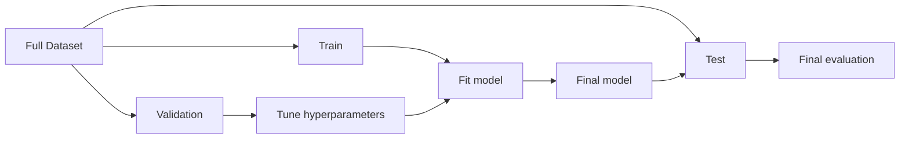

### Roles

| Dataset    | Purpose                        |
| ---------- | ------------------------------ |
| Train      | Learn parameters               |
| Validation | Choose model / hyperparameters |
| Test       | Final unseen evaluation        |

The PDF explicitly says validation is used for hyperparameter tuning while test data is reserved for final evaluation.

---

# 93. Data Leakage

### Wrong

```text
Full dataset
 ↓
Calculate mean
 ↓
Scale
 ↓
Split
```

Test information leaked into preprocessing.

### Correct

```text
Split
 ↓
Train ──→ fit preprocessing
 │
 └──────→ transform
                ↓
             Test
```

### Common leakage sources

* scaling before split
* target encoding before split
* imputation using full data
* feature selection using test data
* outlier thresholds learned from test
* tuning against test repeatedly

---

# 94. Cross-Validation

If the dataset is small:

```text
Dataset
────────────────────────────
| F1 | F2 | F3 | F4 | F5 |
────────────────────────────

Run 1:
TEST  → F1
TRAIN → F2 F3 F4 F5

Run 2:
TEST  → F2
TRAIN → F1 F3 F4 F5

Run 3:
TEST  → F3
TRAIN → F1 F2 F4 F5

Run 4:
TEST  → F4

Run 5:
TEST  → F5

Final score = average
```

The PDF explicitly recommends K-fold CV when there is insufficient data for a separate validation set, while noting its computational cost.

---

# 95. K-Fold Cross-Validation

For (K) folds:

[
\boxed{
CVScore=
\frac1K
\sum_{k=1}^{K}
Score_k
}
]

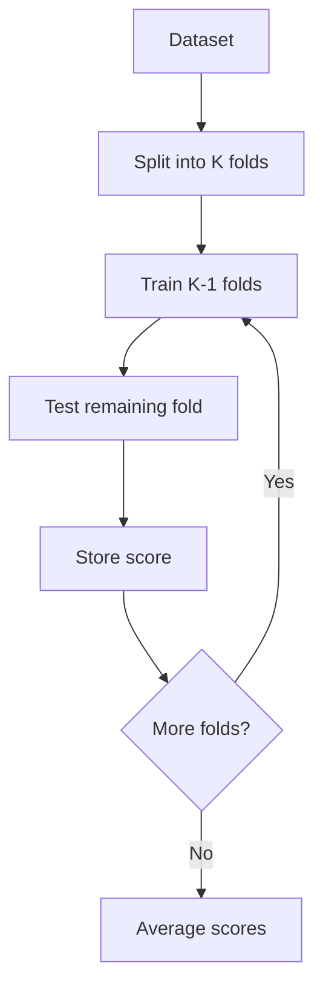

### Useful when

* dataset is small
* model selection matters
* variance of one train/test split is high

### Cost

[
K\text{ training runs}
]

instead of one.

---

# 96. Sampling

The supplied sampling reference defines sampling as selecting a subset from a larger population to save computational resources and time. 

```text
Huge population
████████████████████████████████
              ↓
           sample
              ↓
        manageable dataset
```

But:

```text
Bad sample
   ↓
sampling bias
   ↓
unrepresentative training data
   ↓
bad model
```

---

# 97. Simple Random Sampling

Every observation has an equal chance of being selected.

```text
Population
● ● ● ● ● ● ● ● ● ●
 ↓ ↓   ↓     ↓
Sample
●   ● ●     ●
```

Useful when the population is relatively homogeneous and no special subgroup must be preserved.


---

# 98. Stratified Sampling

```text
Population
├── Group A █████████
├── Group B ███
└── Group C ██

       ↓

Sample preserving representation
├── A █████
├── B ██
└── C █
```

Useful when important subgroups need representation.

The supplied reference uses stratified splitting to maintain class proportions. 

> For regression, stratification is not naturally defined by categorical classes. A common practical extension is to create target bins and stratify approximately by those bins, but this is **additional context**, not a technique explicitly described in the sampling source for regression.

---

# 99. Systematic Sampling

Choose a random starting point, then every (k)-th observation.

```text
1 2 3 4 5 6 7 8 9 10
    ↑     ↑     ↑
   every k
```

Source: 

### Risk

If the ordered dataset has periodic structure matching (k), systematic sampling can become biased.

---

# 100. Cluster Sampling

```text
Population

[A A A] [B B B] [C C C] [D D D] [E E E]
             ↓
       randomly select clusters
             ↓
        [B B B] [D D D]
```

Useful when the population is geographically or naturally clustered.


---

# 101. Sequential Sampling

Select observations one after another until the required sample size is reached.

```text
stream
↓
x₁ → x₂ → x₃ → x₄ → ...
          ↓
     stop at required n
```


---

# 102. Reservoir Sampling

Useful when:

* stream size is unknown
* data arrives continuously
* memory is limited

```text
Unknown stream
────────────────────────→

        ↓
   fixed-size reservoir
   ┌─────────────┐
   │ x │ x │ x │
   └─────────────┘
```

The source states that reservoir sampling maintains equal selection probability while the total stream size is unknown. 

---

# 103. Sampling Cheat Sheet

| Technique     | Core idea                                    | Useful when                             |
| ------------- | -------------------------------------------- | --------------------------------------- |
| Simple Random | Random observations                          | General population                      |
| Stratified    | Sample within groups                         | Preserve subgroup representation        |
| Systematic    | Every (k)-th item                            | Ordered data                            |
| Cluster       | Select groups                                | Geographically/naturally clustered data |
| Sequential    | Take observations sequentially               | Streaming / sequential arrival          |
| Reservoir     | Fixed-size random sample from unknown stream | Streaming                               |

---

# 104. Imbalanced Data — Classification vs Regression

This distinction is critical.

```text
CLASSIFICATION
───────────────
Class A ███████████████
Class B ██

        ≠

REGRESSION
──────────
Target distribution:

      █████████████
   █████████████████
 ████████
                         ██
                         ██
                         ↑
                     rare target region
```

Classification imbalance means **unequal class frequencies**.

Regression imbalance is better thought of as **underrepresented regions of the target distribution**, especially rare/extreme target values.

---

# 105. Classification Imbalance — Mostly Not Linear Regression

The PDF's imbalance section focuses heavily on classification:

```text
Majority class
████████████████████

Minority class
██
```

A classifier may learn to favor the majority class.

Techniques discussed in the supplied PDF include:

* weighted loss
* oversampling
* undersampling
* SMOTE


These are **classification-specific in their class-based formulation**.

---

# 106. Regression Imbalance — Sample Weighting

The supplied GitHub reference explicitly discusses regression imbalance as focusing on rare target values and suggests sample weights. 

Weighted MSE:

[
\boxed{
L=
\frac1n
\sum_i
w_i(y_i-\hat y_i)^2
}
]

```text
Rare / important target region
             ↓
       higher sample weight
             ↓
       larger loss contribution
             ↓
       model focuses more
```

Example from the source:

[
w_i=|y_i-\bar y|+1
]


> ⚠️ This particular weighting rule is an example from the source, **not a universal statistically optimal weighting scheme**.

---

# 107. Weighted Regression

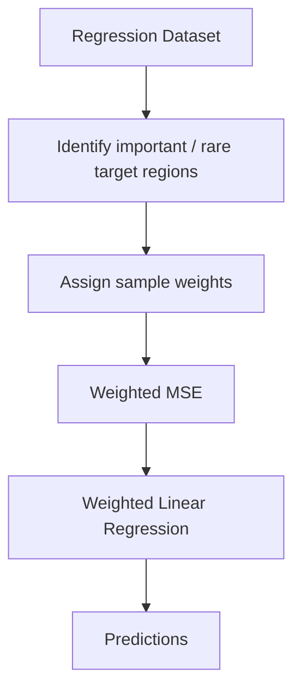

The supplied GitHub reference also demonstrates `sample_weight` for Linear Regression. 

---

# 108. Oversampling / Undersampling / SMOTE

### Classification context

```text
Minority
██

Majority
████████████

Oversampling
██ → ████████████

Undersampling
████████████ → ██

SMOTE
██ → synthetic minority points
```

The PDF describes:

* oversampling as replicating minority samples
* undersampling as removing majority samples
* SMOTE as generating synthetic minority samples using neighboring points. 

### Regression warning

Do **not** blindly apply class-based SMOTE to continuous targets.

For regression, specialized synthetic sampling methods exist, but they require careful target-distribution and feature-space considerations.

---

# 109. Regression Imbalance — Practical Decision

```text
Rare target region?
       │
      YES
       ↓
Is it important to predict accurately?
       │
      YES
       ↓
├── Sample weighting
├── Careful resampling
├── Target transformation
├── More data in rare region
└── Evaluate performance by target region
```

---

# 110. Feature Engineering

Linear Regression is simple in its functional form, so feature engineering is often critical.

```text
Raw features
     ↓
Domain knowledge
     ↓
Useful transformations
     ↓
Better representation
     ↓
Linear model
```

Possible transformations:

* polynomial terms
* interactions
* logarithms
* ratios
* domain-specific features

The Linear Regression source specifically recommends feature engineering and polynomial features when the model is too simple. 

---

# 111. Interaction Features

Suppose:

[
x_1=\text{marketing spend}
]

[
x_2=\text{season}
]

An interaction:

[
x_3=x_1x_2
]

Model:

[
\hat y=w_1x_1+w_2x_2+w_3x_1x_2+w_0
]

```text
X₁ ──────┐
         ├── × ──→ X₁X₂ ──→ Linear model
X₂ ──────┘
```

This allows the effect of one feature to depend on another.

---

# 112. Log Transformations

For highly skewed positive variables:

[
x'=\log(x)
]

or target:

[
y'=\log(y)
]

Potential effect:

```text
Huge values compressed
        ↓
less skew
        ↓
more stable modelling
```

But interpretation changes.

If:

[
\log(y)=w_0+w_1x
]

then:

[
y=e^{w_0+w_1x}
]

so the relationship is no longer linear in the original (y)-scale.

---

# 113. Model Selection

```text
Start simple
   ↓
Linear Regression
   ↓
Residual diagnostics
   ↓
Is model underfitting?
   ├── Yes → feature engineering / polynomial
   │
   └── No
        ↓
Is model overfitting?
   ├── Yes → regularization / simpler features
   │
   └── No → keep
```

---

# 114. Model Complexity vs Problem Complexity

```text
Target relationship
        │
        ├── approximately linear
        │       ↓
        │   Linear Regression
        │
        └── nonlinear
                ↓
        Feature engineering
                ↓
       Polynomial / interactions
```

If the relationship remains highly nonlinear after feature engineering, another model family may be more appropriate.

---

# 115. Dataset Size and Feature Count

The supplied Linear Regression reference gives practical examples:

```text
Small dataset
   ↓
overfitting risk
   ↓
simpler model / regularization / more data


Very large dataset
   ↓
memory / computational cost
   ↓
distributed processing / sampling


Very many features
   ↓
multicollinearity
+
overfitting
+
training cost
   ↓
feature selection / PCA / regularization
```


> ⚠️ **Source note:** The reference gives "10 records per feature" as a rule of thumb. This is not a universal law; appropriate sample size depends heavily on noise, effect sizes, model complexity, dependence structure, and inferential goals.

---

# 116. PCA as a Possible Remedy

```text
Many correlated features
        ↓
      PCA
        ↓
fewer orthogonal components
        ↓
Linear Regression
```

The supplied Linear Regression reference lists PCA as one possible response to high dimensionality / multicollinearity. 

### Tradeoff

```text
Original features
     ↓
interpretable
     ↓
PCA
     ↓
components
     ↓
less directly interpretable
```

---

# 117. Solver / Implementation Perspective

The supplied Linear Regression reference mentions several solver families:

| Solver    | General idea                | Typical use                  |
| --------- | --------------------------- | ---------------------------- |
| SVD       | Stable exact decomposition  | Dense / ill-conditioned data |
| Cholesky  | Fast matrix factorization   | Small dense problems         |
| LSQR      | Iterative least squares     | Large/sparse                 |
| Sparse CG | Conjugate-gradient style    | Large sparse                 |
| SAG       | Stochastic average gradient | Large datasets               |
| SAGA      | Stochastic optimization     | Large/sparse + L1/ElasticNet |


> ⚠️ These solver names and availability depend on the library/model implementation. They should not be treated as interchangeable algorithms for every Linear Regression API.

---

# 118. `fit_intercept`

Model:

[
\hat y=w^Tx+w_0
]

with intercept:

```text
fit_intercept = True
```

If disabled:

[
\hat y=w^Tx
]

forcing:

```text
hyperplane → through origin
```

The supplied reference warns that forcing the intercept to zero can produce incorrect predictions if features are not centered appropriately. 

---

# 119. End-to-End Preprocessing Pipeline

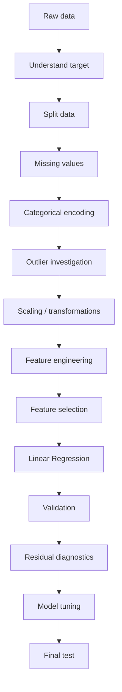

---

# 120. ⚠️ Preprocessing Order Is Not Absolute

The conceptual order is useful, but real pipelines may differ.

Example:

```text
Split
 ↓
Fit preprocessing on train
 ↓
Transform train/validation/test
 ↓
Model
```

Some transformations may be iterative with diagnostics.

The **non-negotiable principle** is:

[
\boxed{
\text{Never learn preprocessing parameters from held-out data}
}
]

---

# 121. Master Problem → Detection → Solution Table

| Problem                 | What you observe                       | How to detect             | Why it happens                        | What to do                                    |
| ----------------------- | -------------------------------------- | ------------------------- | ------------------------------------- | --------------------------------------------- |
| Non-linearity           | Curved residual pattern                | Scatter/residual plot     | Linear form too simple                | Polynomial / transformations / interactions   |
| Multicollinearity       | Unstable coefficients                  | Correlation + VIF         | Redundant predictors                  | Remove/combine/Ridge/PCA                      |
| Perfect collinearity    | Model cannot fit                       | Singular matrix           | Exact feature dependency              | Remove redundant feature                      |
| Heteroskedasticity      | Funnel-shaped residuals                | Residual vs prediction    | Unequal variance                      | Transform target / WLS / robust inference     |
| Autocorrelation         | Residual runs over time                | Time plot / Durbin-Watson | Temporal dependence                   | Lag features / time-series model              |
| Non-normal errors       | Q-Q deviation                          | Q-Q plot                  | Skew/outliers/model misspecification  | Transform / robust methods; inference caution |
| Outliers                | Extreme residuals                      | IQR/Z/IForest/LOF         | Error / rare event                    | Investigate / transform / cap / robust model  |
| Overfitting             | Train low, test high                   | Train/validation curves   | Too much complexity                   | Regularization / simpler features / more data |
| Underfitting            | Train and test high                    | Train/test loss           | Model too simple                      | Feature engineering / reduce regularization   |
| Poor scaling            | Slow GD / coefficient comparison issue | Feature ranges            | Different units                       | Standardize / robust-scale                    |
| Data leakage            | Suspiciously high validation           | Pipeline audit            | Test information entered training     | Rebuild pipeline                              |
| High dimensionality     | Slow / unstable model                  | (d) large                 | Too many predictors                   | Selection / PCA / regularization              |
| Rare target regions     | Poor extreme-target predictions        | Error by target bins      | Few samples                           | Sample weighting / targeted data              |
| Categorical misuse      | Artificial effect/order                | Inspect encoding          | Integer codes treated numerically     | One-hot / ordinal if justified                |
| Target-encoding leakage | Validation too good                    | Pipeline audit            | Encoding learned from held-out target | Out-of-fold encoding                          |

---

# 122. A Practical Diagnostic Decision Tree

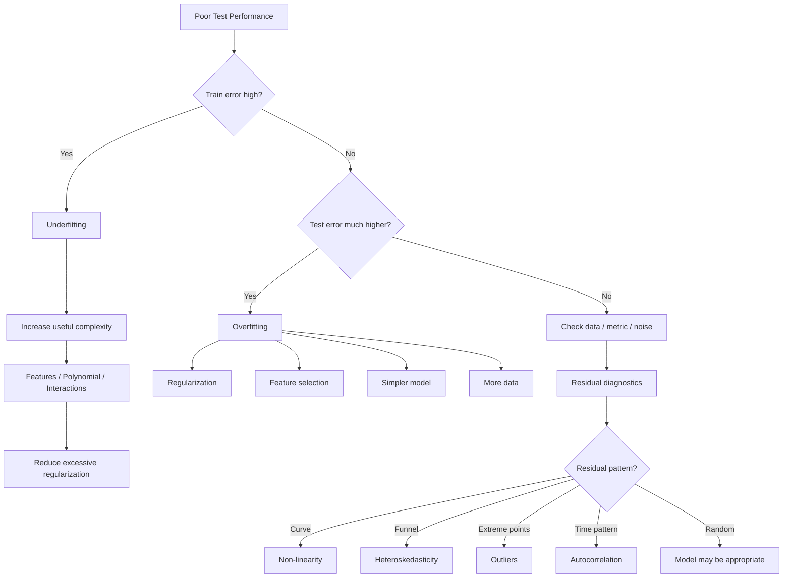

---

# 123. Linear Regression Debugging Order

```text
BAD PERFORMANCE
      ↓
1. Check target
      ↓
2. Check train/test split
      ↓
3. Check leakage
      ↓
4. Check missing values
      ↓
5. Check categorical encoding
      ↓
6. Check outliers
      ↓
7. Check feature scales
      ↓
8. Check multicollinearity
      ↓
9. Check non-linearity
      ↓
10. Check residuals
      ↓
11. Check under/overfitting
      ↓
12. Tune regularization
      ↓
13. Re-evaluate
```

---

# 124. Visual Relationship Map

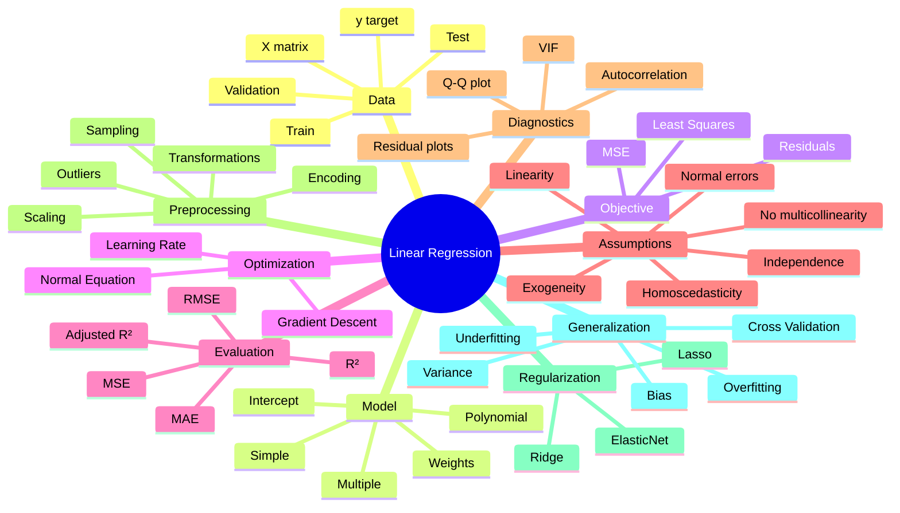

---

# 125. The Entire Mathematical Story

```text
Data:
(Xᵢ, yᵢ)
      ↓
Model:
ŷᵢ = wᵀxᵢ + w₀
      ↓
Residual:
eᵢ = yᵢ − ŷᵢ
      ↓
Loss:
MSE = 1/n Σeᵢ²
      ↓
Optimization:
min MSE
      ↓
Either:
 ├── Gradient Descent
 │      ↓
 │   w ← w − η∇L
 │
 └── Normal Equation
        ↓
   W = (XᵀX)⁻¹XᵀY
      ↓
Best parameters
      ↓
Predictions
      ↓
Residual diagnostics
      ↓
Generalization
```

---

# 126. Linear Regression vs Polynomial Regression

| Property         | Linear       | Polynomial                 |
| ---------------- | ------------ | -------------------------- |
| Raw relationship | Linear       | Can represent curves       |
| Features         | (x)          | (x,x^2,x^3,\ldots)         |
| Parameters       | Linear       | Still linear               |
| MSE              | Yes          | Yes                        |
| Gradient descent | Yes          | Yes                        |
| Normal equation  | Yes          | Yes                        |
| Overfitting risk | Lower        | Higher as degree increases |
| Scaling          | Often useful | Especially important       |

---

# 127. Linear Regression vs Regularized Regression

```text
                 Linear Regression
                        │
          ┌─────────────┼─────────────┐
          ↓             ↓             ↓
       OLS            Ridge         Lasso
        │               │             │
      MSE          MSE + L2       MSE + L1
        │               │             │
      fit data      shrink weights   sparse
```

---

# 128. Why Ridge Helps Multicollinearity

```text
Correlated features
X₁ ≈ X₂
   ↓
OLS can produce unstable large weights
   ↓
L2 penalty
   ↓
discourages large coefficients
   ↓
more stable solution
```

The supplied Linear Regression source explicitly recommends Ridge/Lasso for multicollinearity. 

---

# 129. Why Lasso Helps Feature Selection

```text
100 features
     ↓
L1 penalty
     ↓
some coefficients → 0
     ↓
fewer active features
     ↓
simpler model
```

---

# 130. Why Scaling Matters for Lasso/Ridge

Regularization penalizes coefficient size.

If features have wildly different scales:

```text
same predictive effect
       ↓
different coefficient magnitudes
       ↓
different penalty impact
```

Therefore:

[
\boxed{
\text{Scale features before regularized linear models}
}
]

---

# 131. Model Selection Flow

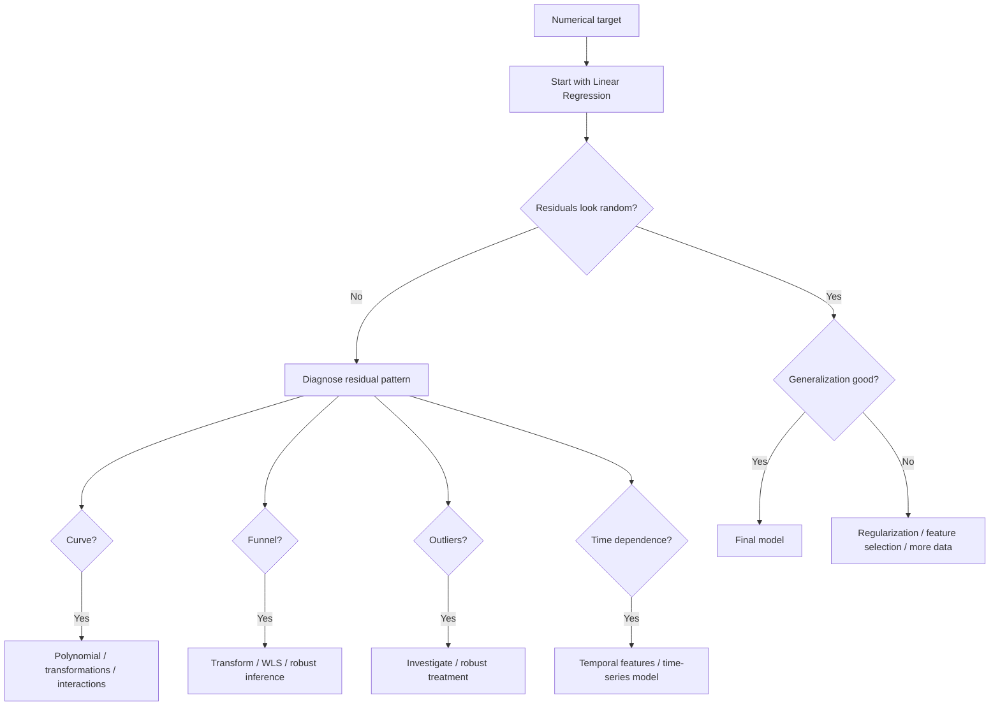

---

# 132. What Linear Regression Is Good At

```text
Continuous target
       +
approximately linear signal
       +
interpretable coefficients
       +
moderate dimensionality
       ↓
       ★
Linear Regression
```

### Strengths

* simple
* fast
* interpretable
* strong baseline
* mathematically well understood
* works well when assumptions are approximately appropriate

---

# 133. What Linear Regression Struggles With

```text
Strong nonlinear relationships
        ↓
        ✗

Extreme outliers
        ↓
        ✗

Highly correlated predictors
        ↓
unstable coefficients

Strong temporal dependence
        ↓
ordinary LR assumptions violated

Very high-dimensional noisy data
        ↓
overfitting / instability
```

The supplied Linear Regression source explicitly lists multicollinearity, overfitting, underfitting, heteroskedasticity, autocorrelation, high-dimensionality and outliers among common issues. 

---

# 134. Source-Specific Notes & Caveats

## ⚠️ "Scaling is required"

The PDF's comparative table marks Linear Regression as requiring scaling.

More precisely:

```text
OLS mathematical solution
→ scaling not strictly required

Gradient Descent
→ scaling strongly useful

Regularization
→ scaling highly important

Coefficient comparison
→ scaling useful
```

---

## ⚠️ "Normality is an assumption"

The source lists normally distributed errors as an assumption. 

More precise interpretation:

```text
Normal errors
     ↓
important for classical inference
     ↓
less essential for simply producing predictions
```

---

## ⚠️ "Outlier = bad"

Not necessarily.

```text
Outlier
 ↓
Investigate
 ↓
Valid rare event? → Keep
Data error?       → Correct/remove
Influential but valid? → Robust strategy
```

---

## ⚠️ VIF threshold

The supplied source uses approximately:

[
VIF>5\text{–}10
]

as a warning. 

Treat this as a **rule of thumb**, not a universal mathematical cutoff.

---

# 135. Formula Sheet — Core

### Model

[
\boxed{\hat y=w^Tx+w_0}
]

### Residual

[
\boxed{e_i=y_i-\hat y_i}
]

### MSE

[
\boxed{
MSE=
\frac1n
\sum_i(y_i-\hat y_i)^2
}
]

### Gradient

[
\boxed{
\nabla_wL=
\frac2n
\sum_i(\hat y_i-y_i)x_i
}
]

### Bias gradient

[
\boxed{
\frac{\partial L}{\partial w_0}
===============================

\frac2n\sum_i(\hat y_i-y_i)
}
]

### Gradient update

[
\boxed{
w\leftarrow w-\eta\nabla_wL
}
]

### Normal Equation

[
\boxed{
W=(X^TX)^{-1}X^TY
}
]

### (R^2)

[
\boxed{
R^2=
1-\frac{\sum(y_i-\hat y_i)^2}
{\sum(y_i-\bar y)^2}
}
]

### Adjusted (R^2)

[
\boxed{
1-
\frac{(1-R^2)(n-1)}
{n-d-1}
}
]

---

# 136. Formula Sheet — Regularization

### Ridge / L2

[
\boxed{
MSE+\lambda\sum_jw_j^2
}
]

### Lasso / L1

[
\boxed{
MSE+\lambda\sum_j|w_j|
}
]

### ElasticNet

[
\boxed{
MSE+
\lambda_1\sum_jw_j^2+
\lambda_2\sum_j|w_j|
}
]

---

# 137. Formula Sheet — Preprocessing

### Standardization

[
\boxed{
z=\frac{x-\mu}{\sigma}
}
]

### Min-Max

[
\boxed{
x'=
\frac{x-x_{\min}}
{x_{\max}-x_{\min}}
}
]

### Robust Scaling

[
\boxed{
x'=
\frac{x-\operatorname{median}(x)}
{IQR}
}
]

### Max-Abs

[
\boxed{
x'=\frac{x}{\max|x|}
}
]

### Unit vector

[
\boxed{
x'=\frac{x}{|x|}
}
]

---

# 138. Formula Sheet — Outliers

### Z-score

[
\boxed{
Z=\frac{x-\mu}{\sigma}
}
]

### IQR

[
\boxed{
IQR=Q_3-Q_1
}
]

[
\boxed{
Lower=Q_1-1.5IQR
}
]

[
\boxed{
Upper=Q_3+1.5IQR
}
]

### Modified Z-score

[
\boxed{
MZ=
\frac{0.6745(x-\operatorname{median})}{MAD}
}
]

---

# 139. Formula Sheet — Regression Metrics

[
\boxed{
MAE=
\frac1n\sum_i|y_i-\hat y_i|
}
]

[
\boxed{
MSE=
\frac1n\sum_i(y_i-\hat y_i)^2
}
]

[
\boxed{
RMSE=\sqrt{MSE}
}
]

[
\boxed{
R^2=1-\frac{SSE}{SST}
}
]

---

# 140. Formula Sheet — Multicollinearity

[
\boxed{
VIF_j=
\frac1{1-R_j^2}
}
]

where (R_j^2) comes from predicting (X_j) using the remaining predictors.

---

# 141. ⚡ Linear Regression in 30 Seconds

```text
TARGET NUMERICAL?
       ↓
      YES
       ↓
ŷ = wᵀx + w₀
       ↓
Residual = y − ŷ
       ↓
MSE = average residual²
       ↓
Minimize MSE
       ↓
┌───────────────┬────────────────┐
│ Gradient Desc │ Normal Equation│
└───────────────┴────────────────┘
       ↓
Check:
• Linearity
• Multicollinearity
• Homoscedasticity
• Independence
• Residual normality for inference
       ↓
Evaluate:
MSE / RMSE / MAE / R² / Adjusted R²
       ↓
If overfit → regularize
If underfit → engineer features
```

---

# 142. ⚡ Assumptions in 10 Seconds

```text
LINEARITY
X ─────────→ Y
approximately linear

NO MULTICOLLINEARITY
X₁ ↔ X₂
   ↓
unstable coefficients
   ↓
VIF

HOMOSCEDASTICITY
Residual spread ≈ constant

NORMAL ERRORS
Q-Q plot ≈ straight line
(mainly inference)

NO AUTOCORRELATION
e₁ ↛ e₂ ↛ e₃

EXOGENEITY
X ↛ error
```

---

# 143. ⚡ Regularization in 10 Seconds

```text
Overfit
  ↓
Too complex
  ↓
Add penalty
  ↓
λ
  ↓
L1 → zeros
L2 → shrink
L1+L2 → ElasticNet
```

---

# 144. ⚡ Outlier Debugging in 10 Seconds

```text
Outlier?
   ↓
Is it real?
 ┌─┴──────────────┐
YES              NO
 ↓                 ↓
Keep / robust    Correct/remove
strategy
```

---

# 145. ⚡ Multicollinearity in 10 Seconds

```text
X₁ ─────────┐
            ├── redundancy
X₂ ─────────┘
      ↓
unstable coefficients
      ↓
VIF
      ↓
remove / combine / PCA / Ridge
```

---

# 146. ⚡ Scaling in 10 Seconds

```text
Different feature scales
        ↓
Optimization / coefficient comparison issues
        ↓
Scale
        ↓
Standardize / Min-Max / Robust
```

---

# 147. ⚡ Residual Debugging

```text
Residuals
    ↓
Random cloud?
 ┌──┴───────────────────────────┐
YES                             NO
 │                               │
Good sign                        Pattern
                                 │
             ┌───────────────────┼───────────────────┐
             ↓                   ↓                   ↓
           Curve               Funnel             Time pattern
             ↓                   ↓                   ↓
        Nonlinearity       Heteroskedasticity   Autocorrelation
```

---

# 148. ⚡ Train / Validation / Test

```text
TRAIN
↓
Learn parameters

VALIDATION
↓
Choose hyperparameters

TEST
↓
One final unbiased evaluation
```

---

# 149. ⚡ Cross-Validation

```text
F1 F2 F3 F4 F5

F1 test → average
F2 test → average
F3 test → average
F4 test → average
F5 test → average

      ↓

Mean CV score
```

---

# 150. ⚡ Encoding

```text
Categorical
     ↓
Nominal?
 ┌───┴────┐
YES       NO
 ↓         ↓
One-hot   Ordered?
           ↓
          YES
           ↓
        Ordinal

High cardinality
       ↓
Frequency / Target
       ↓
WATCH FOR LEAKAGE
```

---

# 151. ⚡ Model Choice

```text
Numerical target
       ↓
Try Linear Regression
       ↓
Residuals okay?
   ┌────┴─────┐
  YES        NO
   ↓          ↓
Tune       Diagnose
regular.      ↓
              ├── Curve → Polynomial/features
              ├── Funnel → Transform/WLS
              ├── Outlier → Investigate
              └── Time → Temporal model
```

---

# 152. Interview / Exam Cards

## Q1. What is Linear Regression?

**A:** A supervised regression model that predicts a continuous target using a linear function of the features.

[
\boxed{\hat y=w^Tx+w_0}
]

---

## Q2. Why is it called Linear Regression?

**A:** The model is linear in its parameters (w), even when feature transformations such as (x^2) are introduced.

---

## Q3. What is the objective?

[
\boxed{
\min_{w,w_0}
\frac1n\sum_i(y_i-\hat y_i)^2
}
]

---

## Q4. Why MSE?

```text
Residual
 ↓
square
 ↓
positive contribution
 ↓
large errors penalized strongly
```

---

## Q5. What is a residual?

[
\boxed{e_i=y_i-\hat y_i}
]

---

## Q6. What does a positive coefficient mean?

```text
Feature ↑
   ↓
Prediction ↑
```

holding other variables constant.

---

## Q7. What does a negative coefficient mean?

```text
Feature ↑
   ↓
Prediction ↓
```

---

## Q8. Why can coefficient magnitude be misleading?

Because features may have different scales.

```text
different scales
      ↓
different coefficient magnitudes
      ↓
bad comparison
```

---

## Q9. Why standardize features?

To make feature scales comparable and improve optimization behaviour; it is particularly important for regularized models and useful for coefficient comparison. 

---

## Q10. Gradient Descent vs Normal Equation?

```text
GD
→ iterative
→ learning rate
→ scalable optimization

Normal Equation
→ closed-form
→ matrix computation
→ expensive with many features
```

---

## Q11. Why does Gradient Descent work well for Linear Regression?

Because MSE produces a convex quadratic objective, so there is a global minimum.

---

## Q12. What happens with a very small learning rate?

[
\boxed{\text{Very slow convergence}}
]

---

## Q13. What happens with a very large learning rate?

[
\boxed{\text{Overshooting / instability / divergence}}
]

---

## Q14. What is multicollinearity?

Strong linear dependence among predictors.

[
x_1\approx\alpha_1x_2+\alpha_2x_3+\cdots
]

---

## Q15. Why is multicollinearity bad?

```text
Overlapping information
       ↓
Hard to isolate individual effects
       ↓
unstable coefficients
       ↓
poor interpretability
```

---

## Q16. How do you detect multicollinearity?

**VIF**.

[
\boxed{
VIF_j=\frac1{1-R_j^2}
}
]

---

## Q17. What does high VIF mean?

The feature can be strongly predicted from the other features.

---

## Q18. How can multicollinearity be handled?

```text
High VIF
 ↓
remove
combine
PCA
Ridge
feature selection
```

---

## Q19. What is heteroskedasticity?

Residual variance changes across the prediction/feature range.

```text
constant spread → homoscedastic
changing spread → heteroskedastic
```

---

## Q20. How do you detect it?

Residual vs predicted-value plot.


---

## Q21. Remedies for heteroskedasticity?

```text
Transform target
Weighted Least Squares
Robust standard errors
```


---

## Q22. What is autocorrelation?

Residuals are correlated across observations, especially time-adjacent observations.

---

## Q23. Why is autocorrelation dangerous?

It violates independent-error assumptions and can make conventional uncertainty estimates unreliable.

---

## Q24. What is Polynomial Regression?

Linear Regression performed after expanding features:

[
x\rightarrow[x,x^2,x^3,\ldots]
]

---

## Q25. Why is Polynomial Regression still Linear Regression?

Because it remains linear in the coefficients.

[
\hat y=w_0+w_1x+w_2x^2
]

is linear in:

[
w_0,w_1,w_2
]

---

## Q26. What is overfitting?

```text
Train error ↓↓↓
Test error ↑
```

Model learns noise instead of generalizable structure.

---

## Q27. What is underfitting?

```text
Train error ↑
Test error ↑
```

Model is too simple.

---

## Q28. Bias vs variance?

```text
High bias
→ consistently wrong
→ underfitting

High variance
→ highly sensitive to training data
→ overfitting
```

---

## Q29. What does regularization do?

Adds a complexity penalty to the loss.

[
L_{total}=L+\lambda\Omega(w)
]

---

## Q30. Ridge vs Lasso?

```text
Ridge
→ L2
→ shrink weights

Lasso
→ L1
→ can set weights to zero
```

---

## Q31. What is ElasticNet?

Combination of L1 and L2.

---

## Q32. Why does (\lambda) matter?

```text
λ small → weak penalty → overfit risk

λ optimal → good generalization

λ large → strong penalty → underfit risk
```

---

## Q33. What is (R^2)?

Measures improvement over the mean-target baseline:

[
R^2=1-\frac{SSE}{SST}
]

---

## Q34. Why use Adjusted (R^2)?

Because it accounts for the number of predictors.

---

## Q35. Why can R² increase when adding a useless feature?

OLS can exploit even a tiny amount of apparent training-sample correlation.

---

## Q36. What is the baseline for regression?

Predict the mean:

[
\hat y=\bar y
]

---

## Q37. Why split validation and test data?

```text
Validation
→ tune

Test
→ final evaluation
```

The test set should remain untouched during model selection.

---

## Q38. Why use K-fold CV?

Useful when data is too small for a reliable dedicated validation split.

---

## Q39. Why are outliers dangerous to Linear Regression?

Because squared loss gives large residuals disproportionately large influence.

---

## Q40. Should every outlier be deleted?

**No.**

Investigate whether it is:

```text
error → fix/remove

valid rare event → keep / robust strategy
```

---

# 153. Final Master Cheat Sheet

```text
╔══════════════════════════════════════════════════════════════════╗
║                  LINEAR REGRESSION                              ║
╠══════════════════════════════════════════════════════════════════╣
║ TARGET                                                          ║
║ Numerical / continuous                                         ║
║                                                                  ║
║ MODEL                                                           ║
║ ŷ = wᵀx + w₀                                                    ║
║                                                                  ║
║ ERROR                                                           ║
║ e = y − ŷ                                                        ║
║                                                                  ║
║ LOSS                                                            ║
║ MSE = 1/n Σ(y − ŷ)²                                              ║
║                                                                  ║
║ OPTIMIZATION                                                    ║
║ Gradient Descent OR Normal Equation                              ║
║                                                                  ║
║ GD                                                              ║
║ w ← w − η∇L                                                     ║
║                                                                  ║
║ NORMAL EQUATION                                                 ║
║ W = (XᵀX)⁻¹XᵀY                                                 ║
║                                                                  ║
║ NONLINEARITY                                                    ║
║ x → [x, x², x³, ...] → Linear Regression                        ║
║                                                                  ║
║ EVALUATION                                                      ║
║ MAE / MSE / RMSE / R² / Adjusted R²                             ║
║                                                                  ║
║ ASSUMPTIONS                                                     ║
║ Linearity                                                       ║
║ Independent errors                                              ║
║ Homoscedasticity                                                ║
║ No problematic multicollinearity                                ║
║ Normal errors → especially inference                            ║
║ Exogeneity                                                      ║
║                                                                  ║
║ DIAGNOSTICS                                                     ║
║ Residual plot → curve / funnel / outliers                       ║
║ Q-Q plot → normality                                            ║
║ VIF → multicollinearity                                         ║
║ Time residuals → autocorrelation                                ║
║                                                                  ║
║ REGULARIZATION                                                  ║
║ Ridge = L2                                                       ║
║ Lasso = L1                                                       ║
║ ElasticNet = L1 + L2                                           ║
║                                                                  ║
║ PREPROCESSING                                                   ║
║ Encode → Scale → Outliers → Features                            ║
║                                                                  ║
║ ENCODING                                                        ║
║ Nominal → One-Hot                                               ║
║ Ordered → Ordinal                                               ║
║ High cardinality → Frequency / Target*                          ║
║ *Target encoding requires leakage-safe validation               ║
║                                                                  ║
║ OUTLIERS                                                        ║
║ Z-score / IQR / Modified Z / IF / DBSCAN / LOF                  ║
║                                                                  ║
║ GENERALIZATION                                                  ║
║ Underfit → high bias                                            ║
║ Overfit → high variance                                         ║
║                                                                  ║
║ VALIDATION                                                      ║
║ Train → learn                                                    ║
║ Validation → tune                                               ║
║ Test → final evaluation                                         ║
║                                                                  ║
║ SMALL DATA                                                      ║
║ K-Fold CV                                                       ║
╚══════════════════════════════════════════════════════════════════╝
```

---

# 154. Final Mental Model

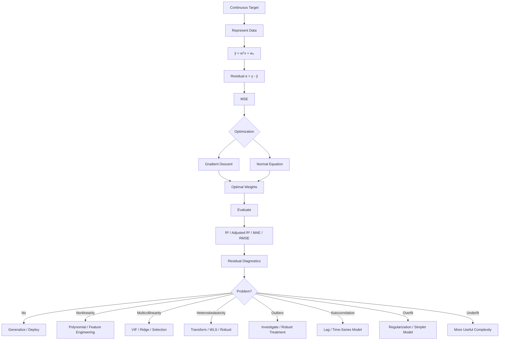

---

# 155. The One-Line Summary

[
\boxed{
\textbf{
Linear Regression = learn the simplest useful linear relationship that minimizes prediction error while generalizing beyond the training data.
}
}
]

```text
                         LINEAR REGRESSION
                                │
            ┌───────────────────┼───────────────────┐
            ↓                   ↓                   ↓
          MODEL               LOSS             GENERALIZATION
            │                   │                   │
       wᵀx + w₀               MSE             Bias ↔ Variance
            │                   │                   │
            ↓                   ↓                   ↓
       Prediction            Optimize           Regularize
            │                   │                   │
            └───────────────────┼───────────────────┘
                                ↓
                         DIAGNOSTIC LOOP
                                ↓
          ┌─────────────┬───────┼────────┬─────────────┐
          ↓             ↓       ↓        ↓             ↓
       Residuals       VIF    Outliers  Scaling   Autocorrelation
          │             │       │        │             │
          └─────────────┴───────┼────────┴─────────────┘
                                ↓
                         IMPROVE → VALIDATE
                                ↓
                           FINAL TEST
```

---

# Source Fidelity & Reference Map

These notes synthesize the supplied references rather than treating Linear Regression as an isolated algorithm.

### Primary Linear Regression reference


Covers the model, types, intercept, regularization, solvers, implementation, multicollinearity, overfitting, underfitting, heteroskedasticity, autocorrelation, dataset size, feature engineering, scaling, and assumptions.

### Categorical Encoding


Covers:

* One-Hot Encoding
* Label Encoding
* Ordinal Encoding
* Frequency Encoding
* Target Encoding
* dimensionality
* artificial ordering
* leakage concerns

### Outlier Handling


Covers:

* removal
* transformation
* winsorization
* imputation
* binning
* RANSAC
* DBSCAN
* treatment considerations

### Outlier Detection


Covers:

* Z-score
* IQR
* Modified Z-score
* Isolation Forest
* DBSCAN
* LOF

### Scaling / Normalization


Covers:

* Min-Max
* Standardization
* Robust Scaling
* Max-Abs
* Unit Vector

### Sampling


Covers:

* Simple Random
* Stratified
* Systematic
* Cluster
* Sequential
* Reservoir Sampling

### Imbalanced Data


Covers the distinction between:

```text
classification class imbalance
            ≠
regression rare-target regions
```

and includes weighted regression / sample weighting.

### ML-1 Revision Notes

The attached PDF explicitly identifies Linear Regression as pages **4–10**, Bias/Variance/Regularization as pages **11–14**, and later sections as classification, kNN, imbalance, trees, ensembles, SVM, etc. 

The Linear Regression portion contributes:

* mathematical representation
* (w^Tx+w_0)
* MSE
* gradient derivation
* Normal Equation
* polynomial regression
* bias/variance
* regularization
* L1/L2/ElasticNet
* train/validation/test
* K-fold cross-validation
* (R^2)
* adjusted (R^2)
* coefficient interpretation
* standardization
* multicollinearity
* heteroskedasticity
* autocorrelation

   

> **Scope note:** Later PDF material such as Logistic Regression's log-loss, confusion matrices, ROC/AUC, KNN, Decision Trees, Random Forests, Naive Bayes, and SVM was not reproduced as standalone algorithm notes because it is outside Linear Regression. Only supporting concepts that materially affect Linear Regression—such as regression imbalance, sampling, bias/variance, residuals, regularization, and model comparison—were incorporated.
